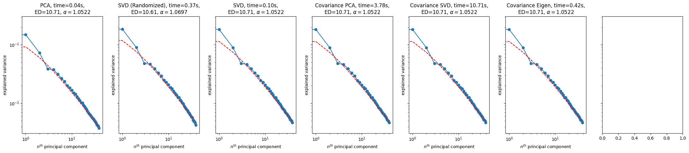
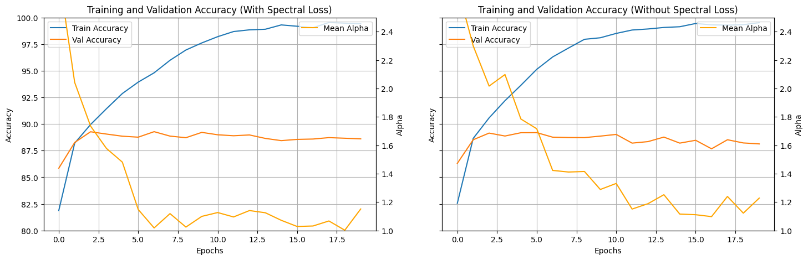

# Computational Neuroscience Research
## Improving Bidirectional Predicitivity via Spectrum Modulation

**BOLD** denotes tasks to be prioritized

### 30/10/2025-13/11/2025
#### TODO
1. ~~calculate alpha value function~~
2. ~~calculate alpha of neural data~~
3. ~~create diff spectral loss~~
4. ~~train basic model with spectral loss~~

#### Log
- encountering problems with brainscore
- trained basic CNN on fashionmnist
- confirmed alpha-value of neural data is around 1
- created differentiable spectral loss
- confirmed spectral losses's effectivity in bringing spectrum to 1, although the differnce is not major, presumably baecause the model's natural spectrum is already around higher than 1 (for such a simple model). However, spectrum at val/train divergence is significantly lower than when spectrum is not modulated.
- cifar100 is slow but will possibly try




### 13/11/2025-27/11/2025
#### TODO 
1. ~~implement F&R EV~~ (18/11/2025)
2. integrate spectral loss with SimCLR
3. **F&R EV for SimCLR**
4. ~~Setup working envo with repo and transfer work~~ (19/11/2025)

#### Log
##### 18/11/2025
- created functions to compute F, R and BPI EV of model for a given brainscore benchmark
- useful commands
    - run ```source .venv/bin/activate``` to activate virtual env
    - run ```export PYTHONPATH="$PWD"```to add src dir to discoverable packages

##### 19/11/2025
- reinstalling venv with python 3.11 and the installing brainscore repo in root directory (by cloning, not using package). doesnt work otherwise
- made brainscore and my notebook compatible with our repo#####

##### 20/11/2025
- FR EV & R2 score negative. it used to be that accuracy on initial trained data neared 100 from the ridge regression. now its at around 23%, and for unseen data after cross val it is negative. cannot make it positive. normalizing doesnt seem to help. 23% agnostic to alpha parameter. 5 fold stratified split. averaged model activations of 4 dim to get 2 dim and make it smaller